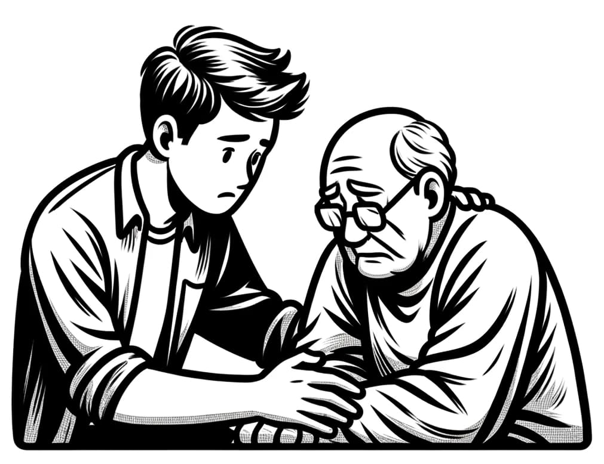

The media is overflowing with stories of people getting scammed. Romance scams, investment scams, charity scams, sextortion and the list goes on. As a tech-savvy person, it is often easy to spot the difference between a genuine email from the bank and a fake phishing email from a scammer. That being said, as the scammers get more sophisticated, even people in the tech industry fall victim to scams.

It’s no wonder that people who are not as digitally literate are particularly vulnerable to these deceptive tactics. It could be someone close to you. Perhaps a relative. Perhaps your uncle.

## My Uncle, The Victim
My uncle had over the past year made a few remarks about some "secret investments" he was making. At first he was very withholding as to the nature of these investments, but after pressing him on the matter, my fears were confirmed.

He had met a young woman online. Even though they had never met in real life, they had quickly struck up a romantic relationship. Only the young woman was in a dire situation. She was supposedly due to receive a significant inheritance in gold, yet she claimed she couldn't access it without first paying a 'retrieval fee' amounting to several thousand dollars. Horrifyingly, my uncle had paid this fee, only to discover that now even larger fees were demanded.

By this stage, all of your spider senses should be going off! The scenario was a textbook example of a classic romance scam. The lack of originality was actually surprising to me. One would think that scammers might have better success if they tried with new approaches.

Yet, the specifics of the story were less important than my uncle's circumstances. Being elderly, single, with ample free time and retirement savings, he was an ideal target. Despite his naturally skeptical disposition, the scammers gradually drew him into their fabricated realm over several months. It was a world filled with adventure and intrigue, where a young woman required his assistance, gold needed to be smuggled from African countries, corrupt officials bribed, and numerous other challenges surmounted.

To an outsider, the whole situation resembled a poorly written crime novel, with my uncle cast as the improbable hero, inadvertently caught up in a tangled web of intrigue and romance. I guess that his belief in these unlikely tales stemmed from a combination of loneliness and the thrill of what seemed like an adventurous, albeit risky, escapade. These elements, coupled with skillful manipulation by the scammers, made the implausible seem all too real to him.

## Our Failed Attempts at Reasoning
As you can imagine, when my uncle's story became known among our family, numerous worried relatives reached out to him. It was surprising and disheartening to find that all our attempts to reason with him proved futile. He dismissed our warnings with laughter. Each time someone pointed out the inconsistencies in the scammers' stories, he would simply retort with 'you don’t understand'. Eventually, it dawned on me that the scammers had skillfully sown seeds of distrust towards us in his mind, effectively cutting him off from our concern.

## With Great Risk Comes Great Reward
Several months had passed since I first became aware of my uncle's so-called investments. I was wary of alienating him by persistently pointing out that he was falling for a scam, yet the thought of passively watching him get swindled was unbearable. Then, one day, I received a text from my uncle: “With great risk comes great reward :)”. Attached was a screenshot of a bank balance boasting an impressively large number.

At last, I thought! This could be the breakthrough I had been waiting for. Gaining access to any material produced by the scammers could potentially enable me to expose their fraudulence. Playing along, I asked my uncle if I could have the bank's website address. A few minutes went by, and then the website's address appeared on my phone!

### 1. The fake looking banking website
The banking website was absurdly poorly built. It used a cheap WordPress theme and several of the pages still had the original "Lorem ipsum..." text that the theme came with! The bank's logo, name and colour scheme had been ripped from a real bank in the UK. Piggy bagging off of a real bank was a smart move, but to a developer, the website looked every bit as fake as it was.

### 2. The clue in the SSL certificate
I looked up the registrar of the domain, but all contact details were hidden. However, the website had a Let's Encrypt SSL certificate, though it's Common Name (CN) was issued to a Nigerian Hotel. Strange for a bank located in the UK, but lucky for me. With the name of the Nigerian Hotel, I was able to find another fake website using the same WordPress theme, but this time fitted for a hotel. I never did figure out what scam the hotel website had been used for, but when I looked up the domain registrar I hit the jackpot! The registrar's name and email address stood there in plain text!

### 3. The amateur web developer
With the name and email address of the domain registrar, I was able to find a string of expired domains the registrar had previously owned. 113 domains to be exact! Many of the domains sounded like banking websites, exchange websites or investment websites. It was all to easy to imagine how they could have been used for scams similar to my uncle's.

I used <a href="https://www.reversecontact.com/" target="_blank">Reverse Contact</a> to search for the registrar and came up with a LinkedIn and Facebook profile belonging to a Nigerian software developer. I also found the software developer's name in some pictures EXIF data. It seems very likely that this is indeed the person behind the websites, but I suspect that he is just a single piece of a bigger operation.

### 4. The fake and the real gold trader
My internet detective skills had brought up some solid findings, but I wasn't prepared to present them to my uncle yet. He had recently told me about a gold trader who overlooked the sale of my uncle's gold investments. This time I asked my uncle for the name, email and website of the gold trader. This time the person and the website seemed genuine and authentic. There was a registered gold trader with that name in the country mentioned on the website. However, the email address my uncle has was a Gmail address. Definitely something I had to look into.

I sent a message to the official email address displayed on the website. I explained the situation without giving away any sensitive details. Honestly, I thought that my message might end up in a spam folder if I used words like Nigerian and Scam and I had already planned on calling up the trader the next day.

To my surprise, the real gold trader replied within a day. This was not the first time someone misused his name to commit fraud in far-away countries. The trader was very polite, but obviously also upset.

### 5. The Developer Turned Hacker
By now I had a good pile of indications and evidence. At the same time, I was sure that the fake banking website contained more information. As any other web developer would have, I attempted to guess the login to the WordPress administration. That didn't work and my IP address was banned for an hour. Now, I don't dislike WordPress per se, but the CMS does carry around some legacy code.

I wondered if I could extract a username from the website. After some Googling, I saw that the WordPress REST API apparently lets anybody fetch the WP users. Really? I pointed my browser at:

~~~
https://fakebank.com/wp-json/wp/v2/users
~~~

And it instantly returned the following:

~~~json
{
  "id": 2,
  "slug": "nimda"
  ...
}
~~~

It looks like WordPress just gave me the administrator username - `nimda` is `admin` spelt backwards! If the username is that weak could the password perhaps be just as weak? Or even worse, could the password be the same as the username? The answer is **YES**!

_I realize that this may be a bit controversial and that some readers will feel that I have overstepped my mark here. My justification is that the potential to prevent an ongoing scam outweighs the breach of digital etiquette. I am not endorsing hacking, I am using my technical knowledge in a responsible way to fight back against a harmful deception._

Logging into the administration of the fake banking website gave me access to everything the scammers had access to on the website. It was plain to see that the sole purpose of this website was to defraud my uncle and only him. Whenever my uncle had "traded" gold someone would manually log into the WordPress administration and update his "bank deposit" and "bank statement".

However, the biggest surprise was hidden deep in the Media archive of WordPress. Passport pictures of what were clearly other victims! I found other materials that confirmed my suspicion that the website had been reused over and over again for similar scams. Seeing these pictures of elderly men, likely victims of the same scam as my uncle, filled me with a profound sense of sadness.

I took screenshots of all of my findings and hoped that this would be the final nail in the coffin of my uncle’s scam!

## Presenting the Evidence to My Uncle
Armed with all the screenshots and my correspondence with the legitimate gold trader, I visited my uncle. We had a talk. A long talk. We went back and forth over the details. I made every effort to translate my technical discoveries into terms that resonated with him.

The challenge was immense: I was attempting to undo a year's worth of fanciful tales and deceit spun by the scammers. Their presence in his life had been constant – even as we spoke, his phone buzzed continuously with their messages. It was understandably overwhelming for him to process and accept the reality of the situation.

Gradually, I began to sense a shift. He began to ask questions, showing a growing understanding and scepticism towards the situation. It was the breakthrough I had been hoping for! A few days later, he filed a report with the police.

## What Happens Once the Lie is Exposed?
Even as I was gathering evidence against the scammers, I grappled with a conflicting fear: what would happen if I successfully convinced my uncle about the scam? I'd be taking away something significant from an elderly man. His primary interactions were with the scammers. The excitement in his life, the allure of romance, and the promise of wealth all stemmed from their fabricated tales.

Honestly, this was the hardest part and still is. Before I even went to see my uncle I had talked to several family members, briefing them about my intentions. I wanted to let them know that my uncle could use our support now more than ever.

We didn't think less of him because he had lost a lot of money on his "investments". His self-imposed isolation didn't change our view of him; his rightful place was, and always will be, among his family.

## Conclusion

Online scams are a crime with real victims and the damage goes far beyond the financial losses. The victims often struggle with shame and a sense of betrayal, which can result in lasting emotional distress.

As an onlooker, it is deeply frustrating to witness someone you care about being deceived and have your warnings dismissed. Yet, we have to persist and to do everything we can to help the victims. Particularly once they come to the painful realization that they have been exploited.

<small>

**Disclaimer** _The victim in this story isn't really my uncle, but another close relative. I have changed a few other details as well to ensure the privacy of everyone._

</small>