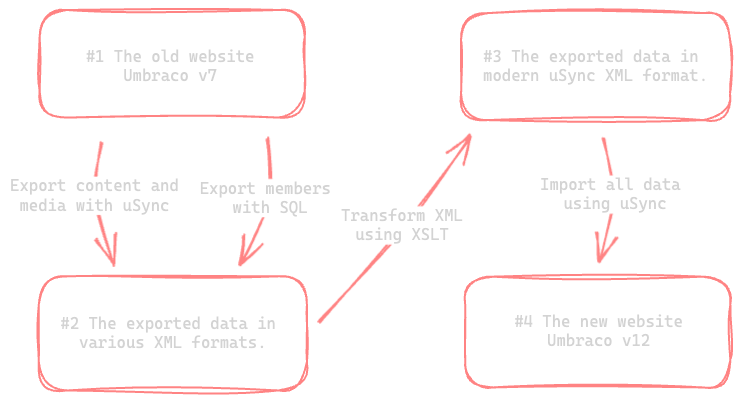

# Migrating Umbraco content, media and members from 7 to 12 using uSync

With Umbraco 7 reaching End-of-Life (EOL) on September 30 2023 the race is on for many developers to get that Umbraco website upgraded.

Having myself just spent the last 6 days in the deep weeds of migrating an Umbraco website from 7 to 12, I thought I would share my approach and what pitfalls to be aware of.

### The stage

To give some context and to make this website comparable to yours, let me provide you with some details. The website is a catalog of food videos and recipes. Some of the recipes are free, but the majority of them are behind a paywall. If you want access to the full recipe catalog you have to become a paying member.

A bit on the technical side:

- Approximately 500 pages, 5.000 images and 10.000+ members.
- Single language website, so no use of dictionary etc.
- Only custom forms, so no use of Umbraco Forms.
- A number of customer property editors and custom dashboards.
- Quite a few integrations to other external API, but I'll leave them out since they are so specific to the project.

Also worth noting is that I am the one who developed the website initially and have upgraded and maintained it these past seven years. In other words, I have a deep understading of all the parts that makes up this website.

### The approach - uSync ftw

Even though Umbraco does support migrating from Umbraco 7 to 8, from 8 to 10 and from then from 10 to 12, I never considered going down that path. Let's be honest - migrating complex website is never fun and I didn't wan't to make it worse by going through **three** migration processes!

Instead my approach would be to export content, media and members from the old version 7 website using [uSync](https://our.umbraco.com/packages/developer-tools/usync/) and import it into the new version 12 website uSync. Sounds easy right?

### The problem - ...

Well, as it turned out that wasn't quite possible. I was able to export content and media using uSync from the old website, but the exported files were in a different format than the format uSync on the new website expected.

It makes sense since those are two very different versions of uSync integrating with very different version of Umbraco! uSync is made to sync data between Umbraco installations of the same version which can't be said to be the case in my situation.

Also, even though uSync has an add-on package for syncing members (uSync.PeopleEdition) that package wasn't supported on the old website.

### The solution - An old friend (XSLT)

Even though I couldn't directly export and import my data using uSync I had still managed to export all of the content and media to disk which was a huge step in the right direction!

I wrote up a small SQL script that would get all of the members with some additional data. Using Azure Data Studio I was able to select all of the members and export them as an XML file.

Now I had all of the data from the old website exported to disk as XML files. It wasn't in a format the uSync could parse, but I thought I has an idea of how to remedy that.

I have been working with Umbraco since version 3. Back then in the good ol' days the sun was always shining, we would get our milk directly from the cows and we would write our Umbraco views using XSLT.

If you haven't heard about XSLT it's a language used to transform XML documents into other formats such as HTML or into other XML documents. That was exactly what I needed!

I created a few pieces of content on the new Umbraco 12 website and exported that content using uSync. Those exports would serve as my reference point, so I knew that the XSLT I was writing would convert the old uSync files into a format the new uSync would be able to work with.

Again using XSLT I also converted the members I had exporting from the database into a format that uSync would be happy with.

### Wrangling old property editors

One of the things that I was most happy to see was that all of the internal references in the imported content still worked. That is, content selected with a content picker, a media picker, a multinode tree picker etc. All of those references still worked after importing them in the new Umbraco website!

On the flip side, some content couldn't be imported at all. Old property editors like the Umbraco.Grid (not the new Block Grid) had tons of JSON that was just as annoying as it looked. Again, XSLT proved to be a big help. Newer versions of XSLT comes with the handy json-to-xml and xml-to-json functions. Those functions allowed me to parse the JSON from Umbraco.Grid with XSLT and transform into a sensible format for uSync to use.

:::note
Huge shout out to uSync
:::
